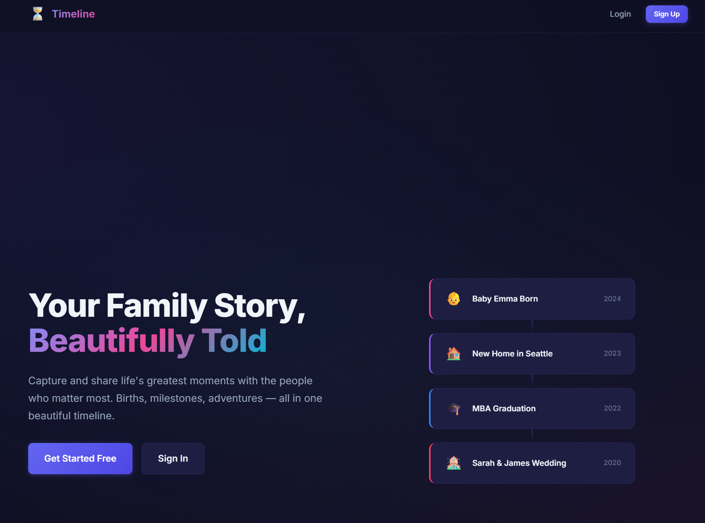
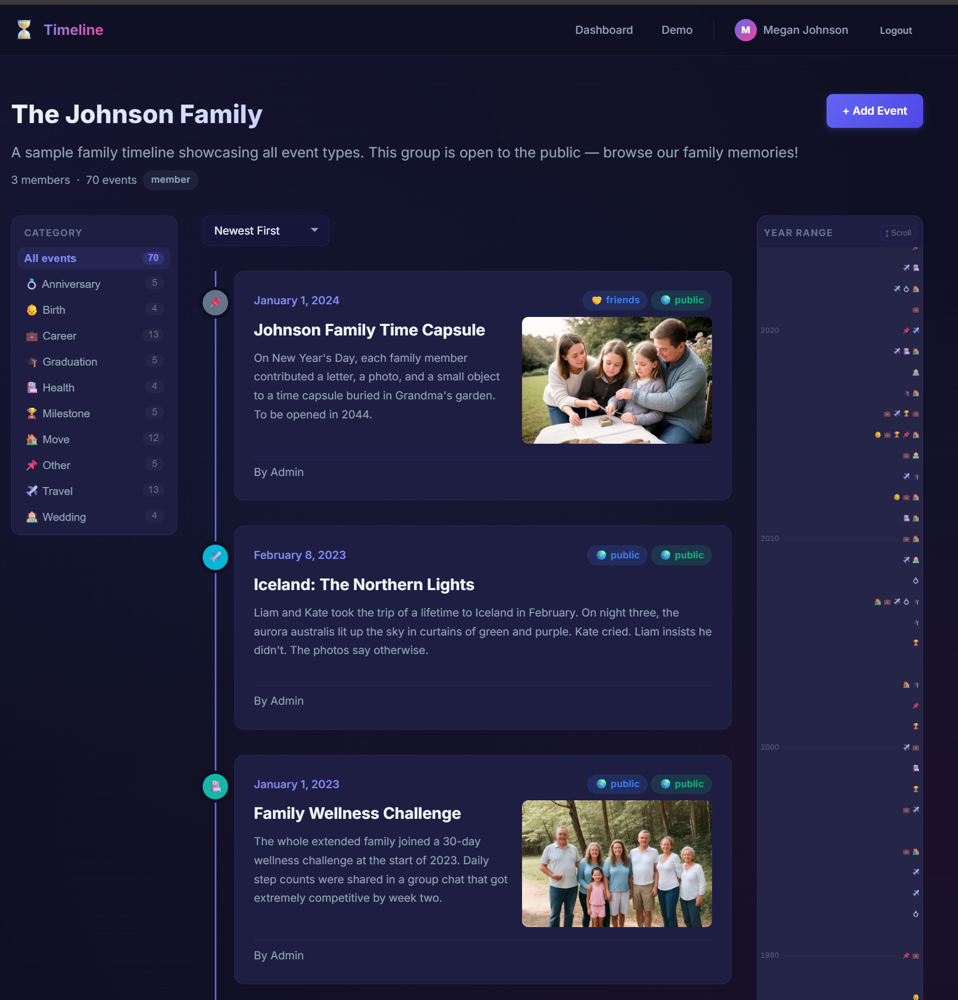

# Family Timeline

A private, multi-user web application for families to record, share, and explore life events together — births, moves, weddings, travels, milestones, and more — all in one beautiful chronological timeline.



---

## Features

- **Family Groups** — Create private group timelines; share an invite code for others to join.
- **Rich Event Timeline** — Chronological timeline with images, descriptions, and album links.
- **10 Event Categories** — Birth, Move, Anniversary, Graduation, Milestone, Wedding, Travel, Career, Health, Other.
- **Year Range Minimap** — VSCode-inspired vertical slider on the right sidebar. Scroll mode navigates the timeline; Filter mode hides events outside the selected range. Direction-aware (matches newest-first / oldest-first sort).
- **Category Filter Sidebar** — Left sidebar for filtering by event category, with per-category event counts.
- **Social Visibility Tiers** — Per-event and per-category defaults: Private → Family → Close Friends → Friends → Acquaintances → Public.
- **Admin Panel** — Super-admin management of users and referral codes.
- **Demo Group** — "The Johnson Family" (70 events, 1980–2024) lets anyone browse without an account.



---

## Tech Stack

| Layer | Technology |
|---|---|
| Backend | Laravel 12, PHP 8.2+, Laravel Sanctum |
| Frontend | React 19, React Router v7, Vite 6 |
| Database | SQLite (dev) |
| Auth | Token-based (Bearer, stored in localStorage) |
| Styling | Vanilla CSS, dark-mode design system |

---

## Quick Start (Laravel Herd)

**Prerequisites**: [Laravel Herd](https://herd.laravel.com/) installed and the `c:\Dev\timeline` folder linked as a site.

```bash
# 1. Install dependencies
composer install
npm install

# 2. Configure environment
cp .env.example .env
php artisan key:generate

# 3. Run migrations and seed demo data
php artisan migrate --seed

# 4. Start everything (Laravel + queue + log viewer + Vite)
composer dev
```

The app is served by Herd at `http://timeline.test`.

> **Note**: On Windows with Herd, use the full PHP path:
> `"C:\Users\r\.config\herd\bin\php.bat" artisan migrate --seed`

---

## Building for Production

```bash
npm run build
```

The `prebuild` script automatically removes any stale `public/hot` file that can cause a blank page when the Vite dev server is not running.

---

## Default Credentials

After seeding, a super-admin account is created:

| Field | Value |
|---|---|
| Email | `admin@family.com` |
| Password | `admin123` |

---

## Documentation

| File | Purpose |
|---|---|
| [INSTRUCTIONS.md](./INSTRUCTIONS.md) | Setup, usage guide, and deployment |
| [HANDOVER.md](./HANDOVER.md) | Technical architecture and codebase overview |
| [CLAUDE.md](./CLAUDE.md) | AI assistant instructions for this project |
